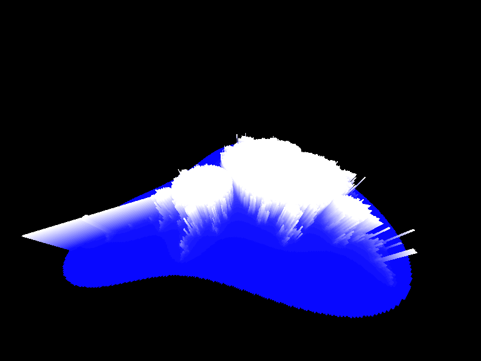
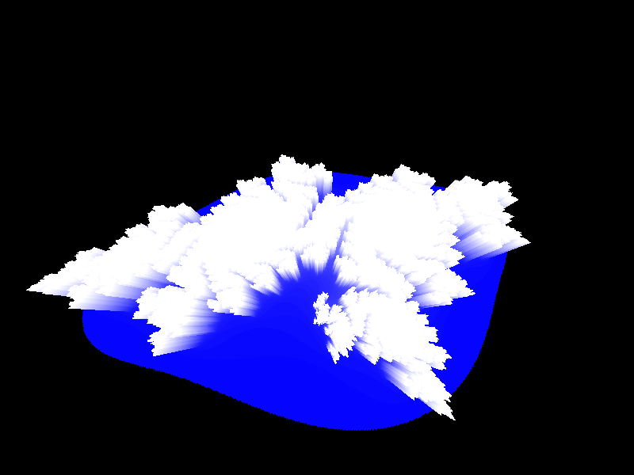

# Voxelbulb

</img>
</img>

`pip install -r requirements.txt`

Fractals: `python DBG_graphics.py` [NEW !]

BHOP: `python graphics.py`

Voxel engine made from scratch with the OpenGL API

### Features:

- 2D & 3D fractal simulation [NEW !]
- Post-processing shaders [NEW !]
- Noise-based terrain generation
- Multithreaded chunk generation
- Chunk caching
- Custom shaders

### Game Features:

- BHOP
- Glide (left shift)

### Post-Processing Shaders (backslash):

- Edge-detection
- Dithering
